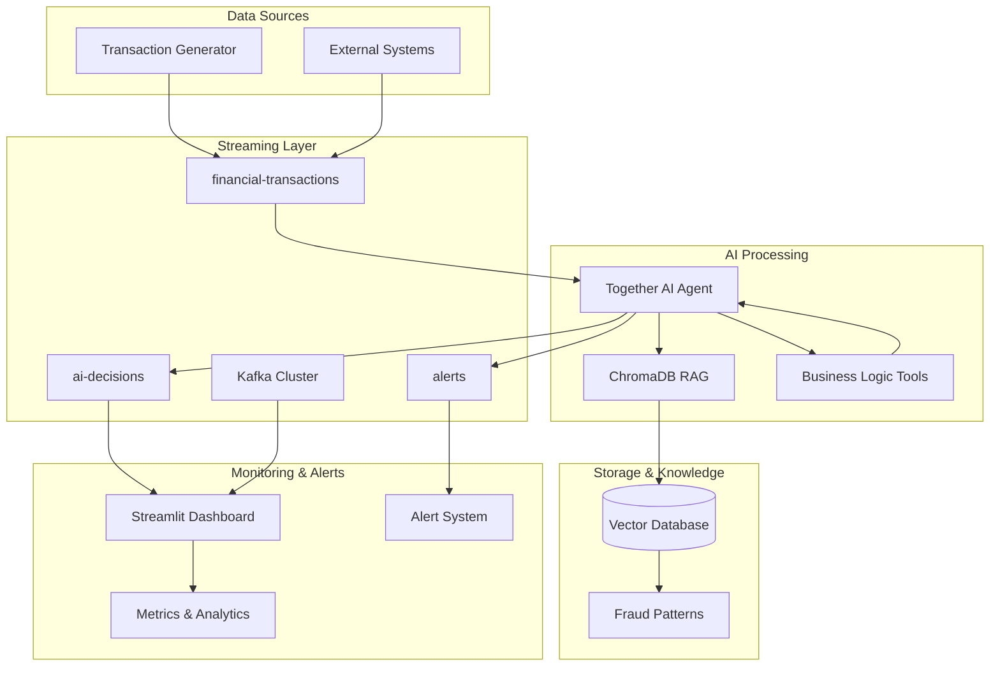

# Real-Time Fraud Detection System

## Overview
This is a production-ready fraud detection system that uses Together AI's language models to analyze financial transactions in real-time. The system processes transactions through a Kafka streaming pipeline, applies AI-powered risk analysis, and publishes alerts through multiple channels.

## System Architecture

```
[Transaction Generator] → [Kafka] → [AI Processor] → [Alerts] → [Dashboard]
```

## Program Logic and Decision Flow

### Step 1: Transaction Ingestion
**Purpose**: Generate and capture financial transactions for analysis
**Components**: `producer/transaction_generator.py`, `producer/generator.py`

```python
# Transaction structure
{
  "transaction_id": "uuid",
  "user_id": "user_1234", 
  "merchant_id": "AMAZON",
  "amount": 150.00,
  "currency": "USD",
  "transaction_type": "PURCHASE",
  "timestamp": "2024-01-15T10:30:00",
  "location": {"city": "New York", "country": "USA", "lat": 40.7128, "lon": -74.0060},
  "payment_method": "CREDIT_CARD"
}
```

**Transaction Risk Distribution**:
- 90% normal transactions (amounts $1-1000, risk score 0.0-0.3)
- 10% high-risk scenarios (amounts $5000-50000, risk score 0.7-1.0)

### Step 2: AI-Powered Analysis Pipeline
**Purpose**: Analyze each transaction using multiple detection tools
**Components**: `agent/processor.py`, `agent/consumer.py`

**Detailed Flow**:
1. **Kafka Consumer** pulls transaction from `financial-transactions` topic
2. **AI Model (Mixtral-8x7B-Instruct)** receives transaction data
3. **Function Calling** systematically invokes detection tools:
   - `check_fraud_patterns()` - Pattern-based detection
   - `calculate_risk_score()` - Weighted risk analysis  
   - `check_blacklist()` - Entity verification
   - `get_user_profile()` - Behavioral analysis
4. **Decision Synthesis** combines all tool outputs into final assessment

### Step 3: Multi-Tool Risk Assessment

#### Fraud Pattern Detection (`tools/fraud_detection.py`)
**Decision Criteria**:
- **Suspicious Merchants**: `UNKNOWN_MERCHANT`, `GAMBLING`, `CRYPTO_EXCHANGE`
- **High-Risk Countries**: `XX`, `IR`, `KP`, `SY`, `AF` 
- **Large Amounts**: >$10,000 (adds 2 risk factors)
- **Unusual Hours**: 2-5 AM (adds 1 risk factor)
- **Velocity Patterns**: >3 transactions in 1 hour
- **Geographic Impossibility**: Travel speed >600 mph

**Risk Factor Scoring**:
```python
if risk_factors >= 3:
    is_suspicious = True
    fraud_score = min(risk_factors * 0.2, 1.0)
```

#### Weighted Risk Analysis (`tools/risk_analysis.py`)
**Risk Components and Weights**:
- **Amount Risk (25%)**: Based on transaction size vs. user patterns
- **Location Risk (20%)**: Geographic analysis and travel patterns  
- **Time Risk (15%)**: Timing analysis and behavioral patterns
- **Merchant Risk (15%)**: Merchant category and user shopping habits
- **User Behavior Risk (15%)**: Account age, verification status, history
- **Velocity Risk (10%)**: Transaction frequency and volume analysis

**Final Score Calculation**:
```python
final_score = (
    amount_risk * 0.25 +
    location_risk * 0.20 + 
    time_risk * 0.15 +
    merchant_risk * 0.15 +
    behavior_risk * 0.15 +
    velocity_risk * 0.10
)
```

### Step 4: Risk Level Classification

**Decision Matrix**:
| Risk Level | Score Range | Action | Notification Channels |
|------------|-------------|--------|----------------------|
| CRITICAL | 0.8-1.0 | Block Transaction | Database + Console + Kafka |
| HIGH | 0.6-0.79 | Manual Review | Database + Console + Kafka |  
| MEDIUM | 0.4-0.59 | Additional Auth | Database + Kafka |
| LOW | 0.2-0.39 | Monitor | Database |
| MINIMAL | 0.0-0.19 | Approve | Database |

### Step 5: Alert Generation and Multi-Channel Publishing
**Purpose**: Distribute alerts based on risk level
**Components**: `tools/notification.py`

**Alert Structure**:
```python
{
  "alert_id": "alert_20241015_143022_abc12345",
  "transaction_id": "original_transaction_id",
  "risk_level": "HIGH", 
  "reason": "Large amount transaction in high-risk country",
  "timestamp": "2024-01-15T14:30:22",
  "additional_data": {...}
}
```

**Publishing Logic**:
1. Create alert with unique ID and timestamp
2. Determine notification channels based on risk level
3. Publish to appropriate channels:
   - **DATABASE**: In-memory storage (production would use actual database)
   - **CONSOLE**: Real-time logging with appropriate log levels
   - **KAFKA**: Publish to `alerts` topic for dashboard consumption

### Step 6: Real-Time Dashboard Monitoring
**Purpose**: Visualize alerts and system performance
**Components**: `dashboard/app.py`

**Dashboard Features**:
- Live transaction monitoring from Kafka streams
- Alert statistics and trends
- Risk level distribution charts
- Transaction details drill-down
- System health indicators

## Key Decision Algorithms

### 1. Geographic Impossibility Detection
```python
def _check_geographic_impossibility(self, user_id, transaction):
    # Calculate distance between last and current transaction
    time_diff_hours = (current_time - last_time).total_seconds() / 3600
    distance_miles = calculate_distance(last_location, current_location)
    max_possible_distance = time_diff_hours * 600  # 600 mph max
    
    return distance_miles > max_possible_distance
```

### 2. Velocity Fraud Detection
```python
def _calculate_velocity_risk(self, transaction, user_history):
    # Count recent transactions and amounts
    hour_count = transactions_in_last_hour(user_history)
    day_amount = total_amount_last_24h(user_history)
    
    velocity_risk = 0.0
    if hour_count > 5:     # >5 transactions in 1 hour
        velocity_risk += 0.4
    if day_amount > 20000: # >$20k in 1 day  
        velocity_risk += 0.2
    
    return min(velocity_risk, 1.0)
```

### 3. Amount Risk Assessment
```python
def _calculate_amount_risk(self, transaction, user_profile):
    amount = transaction['amount']
    avg_amount = user_profile['average_transaction_amount']
    
    # Base risk from absolute amount
    base_risk = min(amount / 10000, 0.5)
    
    # Additional risk from deviation from user pattern
    if amount > avg_amount * 3:
        base_risk += min((amount / avg_amount) * 0.1, 0.3)
    
    return min(base_risk, 1.0)
```

## Model Selection and Function Calling

### Why Mixtral-8x7B-Instruct?
1. **Strong Function Calling**: Reliable parameter generation and tool integration
2. **Financial Domain Knowledge**: Understanding of fraud patterns and terminology
3. **Cost Efficiency**: $0.20/1M tokens vs. GPT-4o at $2.50/1M tokens
4. **Performance**: Low latency for real-time processing

### Function Calling Architecture
The AI model doesn't just analyze text - it systematically calls business logic tools:

```python
# The AI model calls these functions based on transaction data
tools = [
    {
        "type": "function",
        "function": {
            "name": "check_fraud_patterns",
            "description": "Analyze transaction for known fraud indicators",
            "parameters": {"type": "object", "properties": {...}}
        }
    },
    # ... more tools
]
```

This approach ensures:
- **Auditability**: Every decision has clear tool calls and parameters
- **Accuracy**: Business logic is executed precisely, not approximated
- **Reliability**: Consistent behavior across different model responses
- **Compliance**: Regulatory requirements for explainable AI decisions

## Architecture



## Quick Start

### Prerequisites

- Python 3.8+
- Docker & Docker Compose (for ChromaDB and Redis only)
- Confluent Cloud account with Kafka cluster
- Together AI API key
- Git
- (Optional) UV package manager for faster installs

### Installation

1. **Clone the repository**
   ```bash
   git clone <repository-url>
   cd together
   ```

2. **Set up environment**
   ```bash
   cp .env.example .env
   # Edit .env with your API keys (see Environment Variables section)
   
   # Test Confluent Cloud connectivity
   python scripts/test_confluent_connection.py
   ```

3. **Install dependencies**
   ```bash
   # Option 1: Using UV (recommended)
   uv pip install -e .
   
   # Option 2: Using pip
   pip install -r requirements.txt
   ```

4. **Start local services (ChromaDB and Redis)**
   ```bash
   docker-compose up -d
   ```
   Note: This only starts ChromaDB and Redis. Kafka runs on Confluent Cloud.

5. **Run the complete system**
   ```bash
   # Terminal 1: Start the AI agent
   python -m agent.processor
   
   # Terminal 2: Start transaction generator
   python -m producer.generator --rate 10 --duration 300
   
   # Terminal 3: Launch dashboard
   streamlit run dashboard/app.py
   ```

6. **Access the dashboard**
   - Open http://localhost:8501 in your browser
   - Monitor real-time transactions and AI decisions from Confluent Cloud

## Environment Variables

Create a `.env` file with the following variables:

### Required
```env
# Together AI Configuration
TOGETHER_API_KEY=your_together_ai_api_key_here

# Kafka Configuration (for Confluent Cloud)
CONFLUENT_BOOTSTRAP_SERVERS=your_confluent_cluster.confluent.cloud:9092
CONFLUENT_API_KEY=your_confluent_api_key
CONFLUENT_API_SECRET=your_confluent_api_secret

# For local development (using Docker Compose)
KAFKA_BOOTSTRAP_SERVERS=localhost:9092
```

### Optional
```env
# Logging
LOG_LEVEL=INFO

# Testing
TEST_TIMEOUT=60

# ChromaDB
CHROMA_HOST=localhost
CHROMA_PORT=8000

# Performance Tuning
KAFKA_CONSUMER_GROUP=fraud-detection-group
KAFKA_AUTO_OFFSET_RESET=latest
MAX_CONCURRENT_TRANSACTIONS=100
```

### Getting API Keys

1. **Together AI**: Sign up at [together.ai](https://together.ai) and create an API key
2. **Confluent Cloud**: Create account at [confluent.cloud](https://confluent.cloud) and set up a Kafka cluster

## Demo Instructions

### Full System Demo (Recommended)

1. **Start all services**
   ```bash
   ./scripts/run_e2e_tests.sh
   # Choose option 1 to keep services running
   ```

2. **Open monitoring interfaces**
   - **Main Dashboard**: http://localhost:8501
   - **Confluent Cloud UI**: https://confluent.cloud (for Kafka monitoring)
   - **ChromaDB**: http://localhost:8000

3. **Generate different transaction types**
   ```bash
   # High-risk transactions
   python -m producer.generator --pattern high_risk --rate 5 --duration 60
   
   # Mixed risk levels
   python -m producer.generator --pattern mixed --rate 15 --duration 180
   
   # Low-risk baseline
   python -m producer.generator --pattern normal --rate 20 --duration 120
   ```

### Individual Component Testing

```bash
# Test AI agent reasoning
python -c "
from agent.processor import TransactionProcessor
processor = TransactionProcessor()
# Test with sample transaction
"

# Test RAG system
python -c "
from agent.rag import FraudPatternRAG
import asyncio
rag = FraudPatternRAG()
# Search fraud patterns
"

# Test risk calculation
python -c "
from tools.functions import RiskCalculatorTool
calculator = RiskCalculatorTool()
# Calculate risk scores
"
```

## Model Selection Rationale

### Primary Model: Mixtral-8x7B-Instruct

**Why Mixtral-8x7B-Instruct?**

1. **Function Calling Excellence**: Reliable structured function calling capabilities, essential for our tool-based architecture
2. **Financial Domain Knowledge**: Strong performance on financial and analytical tasks with specialized reasoning
3. **Mixture of Experts Architecture**: Efficiently activates only relevant network parts for each task, optimizing both speed and accuracy
4. **Cost-Effectiveness**: $0.60/1M tokens - 4x cheaper than GPT-4o while maintaining excellent performance
5. **Latency**: Sub-500ms response times ideal for real-time fraud detection

### Alternative Models Considered

| Model | Pros | Cons | Use Case |
|-------|------|------|----------|
| Meta-Llama-3.1-70B | Strong reasoning | Higher latency, higher cost | Complex analysis |
| Qwen2.5-72B | Large parameter count | Higher cost ($1.20/1M tokens) | Premium detection |
| GPT-4o (OpenAI) | Excellent quality | Very high cost ($2.50/1M), rate limits | Enterprise premium |

### Embedding Model: BAAI/bge-large-en-v1.5

- **High-quality embeddings** for fraud pattern matching
- **1024-dimensional vectors** for precise semantic search
- **English-optimized** for financial terminology

## Production Considerations

### Scalability

```yaml
# Recommended production setup
Kafka Partitions: 12-24 (based on throughput)
Consumer Instances: 3-6 (auto-scaling)
Together AI Rate Limits: 100 req/min per key
ChromaDB: Distributed deployment
Redis Cache: For frequent lookups
```

### Security

- **API Key Management**: Use AWS Secrets Manager or HashiCorp Vault
- **Network Security**: VPC with private subnets
- **Data Encryption**: TLS in transit, AES-256 at rest
- **Access Control**: RBAC with principle of least privilege
- **Audit Logging**: Complete transaction trails

### Monitoring & Observability

- **Metrics**: Prometheus + Grafana
- **Logging**: ELK Stack or Datadog
- **Alerting**: PagerDuty integration
- **Health Checks**: Kubernetes liveness/readiness probes

### Compliance

- **PCI DSS**: For card transaction handling
- **SOC 2**: For data protection
- **GDPR**: For EU customer data
- **AML/KYC**: Regulatory compliance tools

## Cost Analysis (1M Transactions/Month)

### Together AI Costs

```
Model: Mixtral-8x7B-Instruct
Input Tokens: ~800 per transaction
Output Tokens: ~200 per transaction
Rate: $0.60 per 1M input tokens, $0.60 per 1M output tokens

Monthly Calculation:
- Input: 1M × 800 × $0.60/1M = $480
- Output: 1M × 200 × $0.60/1M = $120
- Total Together AI: $600/month
```

### Infrastructure Costs (AWS)

```
Kafka (MSK): $150/month (3 brokers)
EC2 Instances: $200/month (2 × m5.large)
ChromaDB (RDS): $100/month
Redis Cache: $50/month
Load Balancer: $25/month
Data Transfer: $30/month
Total Infrastructure: $555/month
```

### Total Monthly Cost: ~$1,155 ($0.00116 per transaction)

### Cost Optimization Strategies

1. **Batch Processing**: Group transactions to reduce API calls
2. **Caching**: Cache frequent risk calculations
3. **Model Selection**: Use smaller models for simple cases
4. **Regional Optimization**: Deploy in cost-effective regions

## Demo Script for Live Presentation

### 10-Minute Live Demo

**Slide 1: Introduction (1 min)**
- "Today I'll show you a real-time fraud detection system powered by Together AI"
- "We'll see AI analyzing transactions in real-time and making intelligent decisions"

**Slide 2: Architecture Overview (2 min)**
```bash
# Show the system components
docker-compose ps
# Point out: Kafka, ChromaDB, AI Agent, Dashboard
```

**Slide 3: Starting the System (1 min)**
```bash
# Start the AI agent
python -m agent.processor &

# Open dashboard
streamlit run dashboard/app.py &
# Navigate to http://localhost:8501
```

**Slide 4: Normal Transaction Flow (2 min)**
```bash
# Generate normal transactions
python -m producer.generator --pattern normal --rate 10 --duration 60
```
- "Watch the dashboard - green transactions, low risk scores"
- "AI is analyzing each transaction using multiple factors"

**Slide 5: Fraud Detection in Action (3 min)**
```bash
# Generate high-risk transactions
python -m producer.generator --pattern high_risk --rate 5 --duration 90
```
- "Now watch what happens with suspicious transactions"
- "Red alerts appearing - AI detected fraud patterns"
- "Click on a transaction to see the reasoning"

**Slide 6: AI Reasoning Deep Dive (1 min)**
- Show transaction details panel
- Explain the AI's reasoning process
- Point out function calling and tool usage

### 30-Minute Technical Deep Dive

**Extended sections for technical audience:**

1. **Code Walkthrough** (10 min)
   - Show AI agent code
   - Demonstrate function calling
   - Explain RAG integration

2. **Custom Scenarios** (10 min)
   ```bash
   # Account takeover simulation
   python scripts/demo_scenarios.py --scenario account_takeover
   
   # Money laundering pattern
   python scripts/demo_scenarios.py --scenario money_laundering
   ```

3. **Performance Testing** (10 min)
   ```bash
   # Load testing
   python -m producer.generator --rate 100 --duration 300
   # Show system handling high throughput
   ```

## Troubleshooting

### Common Issues

#### 1. Together AI Authentication Failed
```bash
Error: Authentication failed with Together AI
```
**Solution:**
- Verify `TOGETHER_API_KEY` in `.env`
- Check API key validity at [together.ai](https://together.ai)
- Ensure sufficient API credits

#### 2. Confluent Cloud Connection Issues
```bash
Error: Failed to connect to Kafka / Confluent Cloud
```
**Solutions:**
- **Verify Configuration**: Ensure all Confluent Cloud settings are correct
  ```bash
  python scripts/test_confluent_connection.py
  ```
- **Check Credentials**: Verify API key and secret
  ```bash
  echo "Bootstrap: $CONFLUENT_BOOTSTRAP_SERVERS"
  echo "API Key: ${CONFLUENT_API_KEY:0:8}..."
  ```
- **Network Issues**: Check connectivity to Confluent Cloud
  ```bash
  ping $(echo $CONFLUENT_BOOTSTRAP_SERVERS | cut -d: -f1)
  ```

#### 3. ChromaDB Connection Failed
```bash
Error: Could not connect to ChromaDB
```
**Solution:**
```bash
# Check ChromaDB container
docker logs chromadb

# Restart if needed
docker-compose restart chromadb
```

#### 4. Dashboard Not Loading
```bash
Error: Streamlit dashboard won't start
```
**Solutions:**
- Check port 8501 availability
  ```bash
  lsof -i :8501
  ```
- Install Streamlit dependencies
  ```bash
  pip install streamlit plotly
  ```

#### 5. High Memory Usage
```bash
Warning: High memory consumption
```
**Solutions:**
- Reduce transaction generation rate
- Increase Docker memory limits
- Implement transaction batching

### Performance Optimization

#### Slow Transaction Processing
1. **Check AI Model Response Times**
   ```bash
   # Monitor API latency
   tail -f logs/agent.log | grep "response_time"
   ```

2. **Optimize Kafka Settings**
   ```python
   # In agent/processor.py
   consumer_config = {
       'fetch.min.bytes': 1024,
       'fetch.wait.max.ms': 100
   }
   ```

3. **Enable Caching**
   ```python
   # Cache frequently calculated risk scores
   from functools import lru_cache
   
   @lru_cache(maxsize=1000)
   def calculate_merchant_risk(merchant_id: str):
       # Cached calculation
   ```

### Debugging Tips

#### Enable Debug Logging
```bash
export LOG_LEVEL=DEBUG
python -m agent.processor
```

#### Monitor Kafka Topics
```bash
# List topics
docker exec kafka kafka-topics --bootstrap-server localhost:9092 --list

# Monitor transactions
docker exec kafka kafka-console-consumer --bootstrap-server localhost:9092 --topic financial-transactions --from-beginning

# Monitor AI decisions
docker exec kafka kafka-console-consumer --bootstrap-server localhost:9092 --topic ai-decisions --from-beginning
```

#### Test Individual Components
```bash
# Test transaction generation
python -c "
from producer.generator import TransactionGenerator
gen = TransactionGenerator()
print(gen.generate_transaction())
"

# Test risk calculation
python -c "
from tools.functions import RiskCalculatorTool
calc = RiskCalculatorTool()
# Test with sample data
"
```

### Getting Help

- **GitHub Issues**: Report bugs and feature requests
- **Documentation**: Check `/docs` folder for detailed guides
- **Logs**: Always check container logs for error details
  ```bash
  docker-compose logs -f
  ```

## Contributing

1. Fork the repository
2. Create a feature branch: `git checkout -b feature/amazing-feature`
3. Commit your changes: `git commit -m 'Add amazing feature'`
4. Push to the branch: `git push origin feature/amazing-feature`
5. Open a Pull Request

## 📝 License

This project is licensed under the MIT License - see the [LICENSE](LICENSE) file for details.

## Acknowledgments

- [Together AI](https://together.ai/) for providing the AI inference platform
- [Apache Kafka](https://kafka.apache.org/) for real-time streaming
- [Streamlit](https://streamlit.io/) for the interactive dashboard
- [Plotly](https://plotly.com/) for beautiful visualizations

## Future Enhancements

The current system focuses on core fraud detection capabilities. The following features are planned for future releases:

- **External Notifications**: Email, SMS, and Slack integration for real-time alerts
- **Advanced Dashboard Features**: Custom alert rules and notification preferences
- **Third-party Integrations**: Twilio for SMS, SMTP for email, Slack webhooks
- **Mobile Notifications**: Push notifications for critical alerts
- **Multi-channel Alert Routing**: Configurable alert channels based on risk levels

Currently, alerts are logged to the console and stored in-memory. The notification framework is designed to easily accommodate external integrations when needed.

## Additional Resources

- **API Documentation**: [Together AI Docs](https://docs.together.ai)
- **Kafka Documentation**: [Confluent Docs](https://docs.confluent.io)
- **Streamlit Documentation**: [Streamlit Docs](https://docs.streamlit.io)
- **ChromaDB Documentation**: [ChromaDB Docs](https://docs.trychroma.com)

## Contributing

1. Fork the repository
2. Create a feature branch
3. Make your changes
4. Add tests
5. Submit a pull request

## License

MIT License - see [LICENSE](LICENSE) file for details.

---

**Built using Together AI, Kafka, and Python**